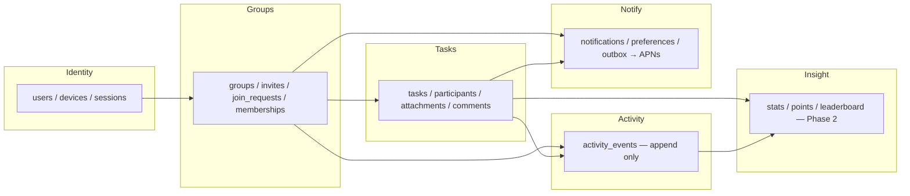

# 01 — Product Architecture

## 1. What the system is

AlMunjez is a **multi-tenant task-ownership system**. The tenant is a *group* (البيت، الشركة،
اللجنة…). A user belongs to many groups and also owns a private, group-less space (مهامي).
Everything the product does is one of five verbs applied to a task inside a tenant:

```
Create  →  Claim  →  Execute  →  Complete  →  Measure
أنشئ       تولَّ       نفّذ        أنجز        قِس
```

The architecture is optimised for two things that pull in opposite directions:

| Goal | Consequence |
|---|---|
| A family member must go from push notification to "سأتولى المهمة" in two taps | Thin client, optimistic UI, minimal required fields, no mandatory configuration |
| A company must trust the record | Every mutation runs server-side with authorization, atomicity and an immutable audit trail |

The resolution is a **thin client over a rule-enforcing database**: the iPhone app never
contains business rules that matter; it renders state and calls named operations.

## 2. Bounded contexts

The product decomposes into six contexts. Each owns its tables and exposes operations to the
others only through the API contract (doc 09). This is what lets the system grow from one family
to an organisation without a rewrite: contexts are split into services later only if load demands.



| Context | Owns | Invariants it guards |
|---|---|---|
| **Identity** | account, profile, device push tokens, locale | one account per Apple ID / phone; device tokens belong to exactly one user |
| **Groups** | group, invitation code, join requests, memberships, roles | private by default; code ≠ access; exactly one owner; owner cannot leave without transfer |
| **Tasks** | task, assignment mode, lifecycle, subtasks, proof, comments | state machine (doc 07); one claimer per open task; proof required before completion when enabled |
| **Activity** | immutable event stream per group | append-only; every important mutation writes exactly one event in the same transaction |
| **Notify** | in-app inbox, preferences, delivery outbox | never notify the actor about their own action; collapse bursts; respect preferences |
| **Insight** | per-user/per-group metrics, points, leaderboard | visibility policy per group; computed from events and tasks, never hand-edited |

## 3. Layered view

```
┌──────────────────────────────────────────────────────────────┐
│  iPhone app (Flutter, Arabic-first RTL)                       │
│  · screens / widgets           · offline read cache            │
│  · optimistic state (Riverpod)  · deep links from push         │
└───────────────▲───────────────────────────────▲───────────────┘
                │ HTTPS + JWT                   │ Realtime (WebSocket)
┌───────────────┴───────────────────────────────┴───────────────┐
│  Supabase platform                                             │
│  · Auth (Sign in with Apple, phone OTP)                        │
│  · PostgREST: table reads filtered by Row-Level Security       │
│  · RPC: every mutation is a SQL function (SECURITY DEFINER)    │
│  · Storage: private buckets, signed URLs, path-scoped policies │
│  · Realtime: row changes for tasks / notifications the user    │
│    is allowed to see                                           │
│  · Edge Functions (TypeScript): push sender, AI planner (later)│
│  · pg_cron: deadline reminders, overdue sweeps, recurrence     │
└───────────────────────────────┬───────────────────────────────┘
                                │
┌───────────────────────────────▼───────────────────────────────┐
│  Postgres 15+                                                  │
│  · schema in backend/schema/001_initial.sql                    │
│  · RLS policies = the authorization model (doc 06)             │
│  · triggers: updated_at, activity append-only, notify fan-out  │
└────────────────────────────────────────────────────────────────┘
```

Why the mutation surface is "SQL functions only":

* an operation like *claim* needs a conditional `UPDATE … RETURNING` inside one transaction
  together with an activity event and a notification row; a function makes this a single unit;
* the function body is the single source of truth for a rule, testable with pgTAP without an app;
* the same functions can later sit behind a dedicated API service (doc 09 §6) unchanged.

## 4. Read model vs write model

| Operation | Path | Reason |
|---|---|---|
| Lists, detail screens, search | direct table/view reads through PostgREST, filtered by RLS | cheap, cacheable, realtime-subscribable |
| Anything that changes state | RPC function | atomicity, invariants, audit event |
| Files | Storage with signed URLs issued only after an RLS check | never expose a guessable path |

Two views are first-class because the home screen depends on them:

* `v_my_tasks_today` — union of personal tasks, tasks assigned to me, tasks I claimed, due today
  or overdue, across all my groups. One query answers "what do I have to do today?"
* `v_group_dashboard_counts` — counts per status for a group, computed with the derived overdue rule.

## 5. Scaling path

| Stage | Tenants | What changes |
|---|---|---|
| MVP | families, small teams (≤ 50 members/group) | single Postgres, RLS, pg_cron, Edge Functions |
| Growth | SMEs, hundreds of groups | read replicas for lists; notifications outbox moved to a queue worker; stats materialised nightly |
| Organisation | company → departments → teams | `groups.parent_group_id` (already nullable in schema) enables hierarchy; org-level admins; SSO provider added to Auth; dedicated API service in front of the same SQL functions |

Nothing in the MVP schema has to be migrated to reach the last stage; only new tables and
services are added. This is the reason for the deliberately "wide but nullable" task table and for
`memberships.permissions` being a JSON override rather than a fixed enum.

## 6. Non-goals for the architecture

* No general chat. Comments are per task only and have no read receipts, threads or reactions.
* No public groups, discovery, or social graph.
* No AI in the request path. The AI planner (Phase 3) produces *proposed* tasks that go through the
  same `create_task` RPC after the user confirms.
