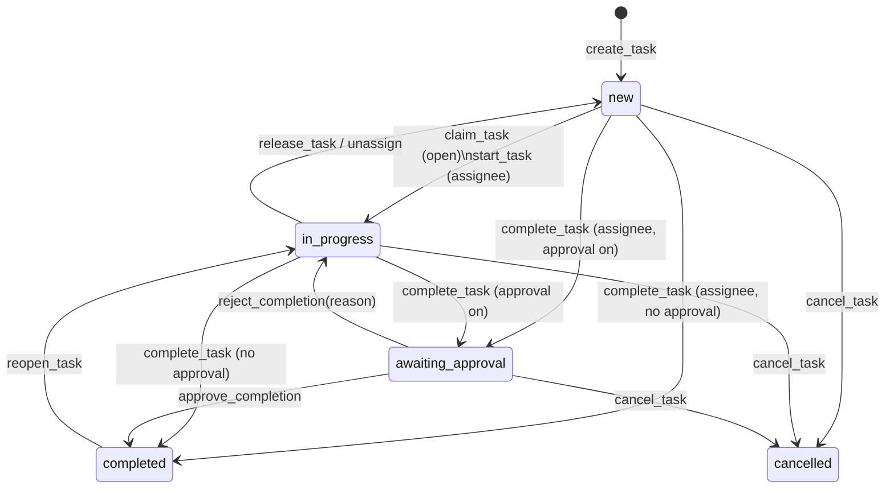

# 07 — Task State Machine

## 1. States

Five **stored** states and one **derived** flag.

| Stored status | Arabic | Terminal | Meaning |
|---|---|---|---|
| `new` | جديدة | no | created; either open (no assignee) or assigned (assignee set) but not started |
| `in_progress` | قيد التنفيذ | no | someone owns and is working on it |
| `awaiting_approval` | بانتظار الاعتماد | no | executor says done; an approver must confirm |
| `completed` | مكتملة | yes* | done (and approved if approval was required) |
| `cancelled` | ملغاة | yes | withdrawn by creator/admin; kept for the record |

\* `completed` can be reopened by creator/admin (→ `in_progress`); this is the only exit from a
terminal state and is itself an audited event.

**Derived:** `is_overdue = due_at IS NOT NULL AND due_at < now() AND status IN ('new','in_progress','awaiting_approval')`.
It is a column in views, never in the table. Filters and badges use it; the scheduler only
*notifies* about it (doc 08 §4), it never writes it.

## 2. Diagram



## 3. Transition table (authoritative)

"Actor" is checked inside the SQL function using the caller's `auth.uid()` and the permission
model of doc 06. `P(x)` = caller holds permission `x` in the task's group.

| # | From | To | Operation | Allowed actor | Guards | Event | Notifies |
|---|---|---|---|---|---|---|---|
| T1 | — | new | `create_task` | any active member with `task.create` (personal: self) | assigned mode requires `P(task.assign_others)` unless assigning self; assignee must be an active member | `task.created` | open: eligible members; assigned: assignee |
| T2 | new (open) | in_progress | `claim_task` | any active member | `assignee_id IS NULL` at commit time (atomic) | `task.claimed` | creator; other members see via realtime only |
| T3 | new (assigned) | in_progress | `start_task` | assignee | — | `task.started` | none |
| T4 | new / in_progress | completed | `complete_task` | assignee (or creator of a personal task) | `requires_approval = false`; if `requires_proof`, a proof attachment or note must exist | `task.completed` | creator |
| T5 | new / in_progress | awaiting_approval | `complete_task` | assignee | `requires_approval = true`; proof rule as T4 | `task.submitted` | creator + `P(task.approve_completion)` |
| T6 | awaiting_approval | completed | `approve_completion` | creator or `P(task.approve_completion)`, **never the assignee** | — | `task.approved` | assignee |
| T7 | awaiting_approval | in_progress | `reject_completion(reason)` | as T6 | reason non-empty | `task.rejected` | assignee |
| T8 | in_progress | new (open) | `release_task` | assignee | — | `task.released` | creator |
| T9 | in_progress / new(assigned) | new (assigned to other) | `reassign_task` | creator or `P(task.assign_others)` | new assignee active member | `task.reassigned` | old + new assignee |
| T10 | in_progress / new(assigned) | new (open) | `unassign_task` | creator or `P(task.assign_others)` | — | `task.unassigned` | old assignee |
| T11 | new / in_progress / awaiting_approval | cancelled | `cancel_task` | creator or `P(task.cancel_any)` | — | `task.cancelled` | assignee (if any) |
| T12 | completed | in_progress | `reopen_task` | creator or `P(task.edit_any)` | within 30 days of completion | `task.reopened` | assignee |
| T13 | any non-terminal | same | `update_task` (title, description, due, priority, points, proof/approval flags) | creator or `P(task.edit_any)` | changing `requires_approval` while awaiting is rejected | `task.updated` | assignee if due/priority changed |

Everything not in the table raises `invalid_transition` and nothing is written.

## 4. Atomic claim

The whole product promise rests on this statement. It is the body of `claim_task`:

```sql
UPDATE tasks
   SET assignee_id = v_uid,
       status      = 'in_progress',
       claimed_at  = now(),
       started_at  = now(),
       version     = version + 1
 WHERE id = p_task_id
   AND status = 'new'
   AND assignment_mode = 'open'
   AND assignee_id IS NULL
RETURNING id INTO v_id;

IF v_id IS NULL THEN
  -- someone else won, or the task is no longer open; tell the caller who
  SELECT status, assignee_id INTO ... FROM tasks WHERE id = p_task_id;
  RAISE EXCEPTION USING ERRCODE = 'P0002', MESSAGE = 'already_claimed', DETAIL = ...;
END IF;
```

Why this is sufficient without explicit locks: Postgres evaluates the `WHERE` clause again on the
current row version after acquiring the row lock (READ COMMITTED). Of N concurrent claimers only
the first sees `assignee_id IS NULL`; the others see the committed assignee and update zero rows.
No advisory locks, no retry loops, no version check needed for this particular transition.

`version` (optimistic lock) is still maintained for `update_task`, where the client sends the
version it last saw and gets `stale_version` if someone edited the task meanwhile.

## 5. Proof-of-completion rule

```
requires_proof = true  ⇒  complete_task must find ≥ 1 row in task_attachments
                          WHERE task_id = p_task_id AND kind = 'proof' AND uploader_id = v_uid
                          OR a non-empty p_note (stored as a comment with kind = 'proof_note')
```

Proof types allowed are listed in `tasks.proof_types` (`{photo,file,note}`); the client shows
only those capture options. The server checks only that *some* allowed proof exists.

## 6. Subtasks (collaborative mode)

* A subtask is a task with `parent_task_id` set; it follows this same machine independently.
* Parent auto-completion: a trigger after any subtask reaches `completed` checks whether every
  sibling is `completed` or `cancelled`; if so and the parent's `auto_complete_on_subtasks` is true,
  the parent moves to `completed` (or `awaiting_approval`) with actor = the last completer.
* Cancelling a parent cascades `cancel_task` to non-terminal subtasks.
* Depth is limited to 1 (subtask of a subtask is rejected) to keep the UI flat.

## 7. Recurring instances (Phase 2)

A recurrence rule is a *template*, not a task. The scheduler materialises the next instance as a
normal `new` task with `recurrence_id` set and `occurrence_key = rule_id || ':' || due date`
(unique), which makes generation idempotent across scheduler retries. Instances then follow this
machine unchanged.
