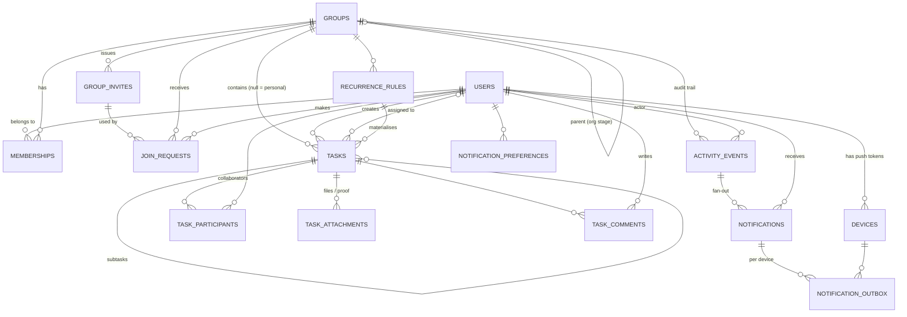

# 10 — Data Model Relationships

## 1. Entity-relationship diagram

## 2. Cardinalities and the rules behind them

| Relationship | Cardinality | Rule |
|---|---|---|
| user ↔ group | n : m through `memberships` | one membership row per (group, user), status tracks active/removed/left so history is kept |
| group → owner | 1 : 1 | `groups.owner_id` plus a partial unique index on `memberships(group_id) WHERE role='owner' AND status='active'` |
| group → active invite | 1 : 0..1 | partial unique index `WHERE revoked_at IS NULL` |
| group → join request (pending) per user | 1 : 0..1 | partial unique index `WHERE status='pending'` |
| task → group | n : 0..1 | `NULL` = personal task; personal tasks have `creator_id = assignee_id` |
| task → assignee | n : 0..1 | exactly one owner of execution at a time; collaborative mode uses `task_participants` in addition |
| task → parent | n : 0..1 | depth 1 enforced by trigger |
| task → recurrence rule | n : 0..1 | `occurrence_key` unique per rule |
| task → attachments | 1 : n | `kind ∈ {attachment, proof}` |
| activity event → notifications | 1 : n | one per recipient; `source_event_id` links back for dedup |
| notification → outbox | 1 : n | one per active device of the recipient |

## 3. Identity of "who is responsible"

The answer to «من المسؤول؟» is always resolved in this order:

1. `tasks.assignee_id` if set (assigned, claimed, or reassigned);
2. otherwise, for collaborative tasks, the set of `task_participants`;
3. otherwise nobody — the task is open and shows «سأتولى المهمة».

Statistics attribute a completion to `assignee_id` at completion time (copied into
`tasks.completed_by` so later reassignment of a reopened task does not rewrite history).

## 4. Time

| Column | Type | Meaning |
|---|---|---|
| `created_at`, `updated_at` | `timestamptz` | server time, UTC |
| `due_at` | `timestamptz` | absolute instant; the client converts using the user's timezone |
| `due_date_only` | `boolean` | when true the UI shows only the date and the deadline is end-of-day in the *creator's* timezone at creation (stored as instant) |
| `users.timezone` | IANA string | for rendering and for "today" sections; default `Asia/Kuwait` |

"Today" in `v_my_tasks_today` is computed with the caller's timezone passed as a parameter, so the
view is correct for a family split between Kuwait and London.

## 5. Denormalised columns (deliberate)

| Column | Why |
|---|---|
| `tasks.group_id` on comments/attachments (via task) | not duplicated; policies join through `tasks` — one join is cheap and avoids drift |
| `tasks.completed_by` | history stability (see §3) |
| `tasks.search_text` (generated, normalised Arabic) | fast search without a separate index table |
| `memberships.permissions` JSONB | avoids a permission table until custom roles exist |
| `groups.member_count` | maintained by trigger, shown in invite preview without exposing members |

## 6. Deletion semantics

Nothing that another member saw is ever hard-deleted:

| Entity | On "delete" |
|---|---|
| task | `cancelled` |
| comment | `deleted_at` set, body hidden («حُذف التعليق») |
| membership | `status = removed/left`, `left_at` |
| group | `archived_at`; members keep read access, no writes |
| user | anonymised (doc 05 §6) |
| device, personal task, notification, preference | hard delete (only the user ever saw them) |
