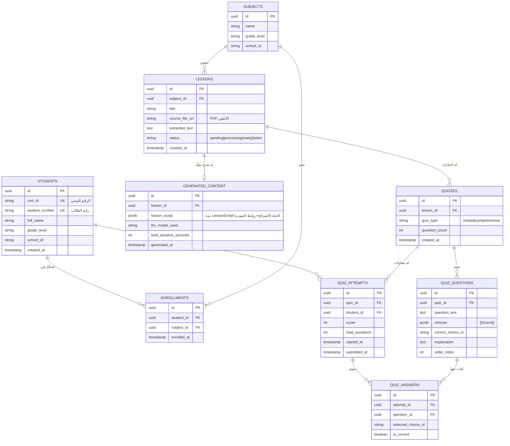

<div dir="rtl">

# منصة التعليم الذكي — الوثيقة التقنية الكاملة

بديل الذكاء الاصطناعي عن المدرّس الخصوصي: تحليل المناهج، توليد شروحات
مبسّطة تركّز على الأمثلة التطبيقية، تحويلها لتجربة "شبه فيديو" (شرائح +
صوت متزامن) بلا تكلفة رندرة فيديو، ثم تقييم فوري وشامل.

> الواجهة الأمامية: **Flutter** (iOS / Android / Web من قاعدة كود واحدة).
> الواجهة الخلفية: **Python**، لأن كل المهام الثقيلة (تحليل PDF، LLM،
> TTS، تصحيح تلقائي) هي مهام معالجة نصوص/ذكاء اصطناعي يتفوق فيها
> نظام Python البيئي (LangChain, PyMuPDF, whisper/TTS SDKs) على أي بديل.

---

## 1. هيكلية النظام (System Architecture)

### 1.1 اختيار المكدس التقني

| الطبقة | التقنية | السبب |
|---|---|---|
| Front-end | Flutter (Dart) | مطلوب من المستخدم؛ قاعدة كود واحدة لكل المنصات |
| API Gateway | **FastAPI** (Python 3.12) | Async native، توليد OpenAPI تلقائياً، أسرع أطر Python، تكامل ممتاز مع SDKs الذكاء الاصطناعي |
| معالجة الملفات (PDF→نص) | **PyMuPDF (fitz)** + **Unstructured.io** للـ PDF المصوّر (OCR عبر Tesseract/Google Vision) | استخلاص نص، عناوين، وحدات (chapters) من كتب PDF إلكترونية |
| المهام الطويلة/غير المتزامنة | **Celery + Redis** (أو RQ لتبسيط أولي) | توليد الشرح + الصوت + الأسئلة قد يستغرق 10–60 ثانية؛ لا يجوز حجز اتصال HTTP لهذه المدة |
| قاعدة البيانات | **PostgreSQL** (+ pgvector لاحقاً لبحث دلالي في المحتوى) | علائقية، تدعم JSONB لتخزين محتوى الشرائح مباشرة |
| التخزين الكائني (ملفات) | **S3-compatible** (AWS S3 / Cloudflare R2 / MinIO ذاتي الاستضافة) | ملفات PDF الأصلية + ملفات MP3 الناتجة عن TTS |
| الكاش وقائمة المهام | **Redis** | نتائج Celery، Rate limiting، تخزين مؤقت لردود LLM المتكررة |
| نموذج اللغة (LLM) | **Claude (Anthropic API)** كخيار أساسي، أو GPT-4o كبديل | تلخيص + توليد أمثلة + توليد أسئلة اختبار |
| تحويل النص لصوت (TTS) | **ElevenLabs** أو **OpenAI TTS** (أو Azure Speech لدعم عربي فصيح ولهجات) | جودة صوت عربي طبيعي ضرورية لتجربة "المدرّس" |
| المصادقة | **JWT** + جدول `students` بمطابقة الرقم المدني/رقم الطالب مقابل قاعدة بيانات المدرسة (SSO/استيراد دفعي) | تسجيل دخول بلا كلمة مرور معقّدة، ومطابقة مباشرة مع نظام المدرسة |
| النشر | حاويات Docker، FastAPI خلف Uvicorn/Gunicorn، Celery workers منفصلة قابلة للتوسع أفقياً حسب الحمل | فصل "طبقة الاستجابة السريعة" عن "طبقة التوليد الثقيلة" |

### 1.2 مخطط التدفق العام

```mermaid
flowchart LR
    subgraph Client["تطبيق Flutter"]
        A[شاشة الدخول] --> B[Dashboard: موادي]
        B --> C[شاشة الدرس]
        C --> D[مشغّل الشرائح+الصوت]
        C --> E[الاختبار الذكي]
    end

    subgraph API["FastAPI (طبقة الاستجابة السريعة)"]
        F[/auth/login/]
        G[/subjects/me/]
        H[/lessons/{id}/generate  (يبدأ مهمة)]
        I[/lessons/{id}/status]
        J[/quiz/{lesson_id}/generate]
        K[/quiz/{attempt_id}/submit]
    end

    subgraph Workers["Celery Workers (طبقة التوليد الثقيلة)"]
        L[استخلاص نص PDF]
        M[LLM: تبسيط + أمثلة]
        N[LLM: توليد أسئلة]
        O[TTS: توليد صوت لكل شريحة]
    end

    Client --> API
    H --> L --> M --> O
    M --> N
    Workers -->|كتابة JSONB + رفع MP3| DB[(PostgreSQL)]
    O -->|رفع ملفات صوت| S3[(Object Storage)]
    D -->|GET slides.json + مسارات mp3| S3
    I --> DB
```

### 1.3 لماذا الفصل بين API وWorkers؟

توليد شرح كامل لدرس (نص + 8–15 شريحة + صوت لكل شريحة) قد يستغرق دقيقة أو
أكثر. طلب HTTP لا يجب أن ينتظر ذلك:

1. الطالب يضغط "أنشئ الشرح" → `POST /lessons/{id}/generate` يرجع فوراً
   `task_id` بحالة `PENDING`.
2. Celery worker يعمل في الخلفية: PDF → نص → LLM → JSON شرائح → TTS لكل
   شريحة → حفظ في `generated_content` وتحديث الحالة إلى `READY`.
3. تطبيق Flutter يستطلع (polling كل 3 ثوانٍ) أو يستمع عبر WebSocket/SSE
   لـ `/lessons/{id}/status` حتى تصبح `READY`، ثم يجلب المحتوى الجاهز.

هذا النمط (Fire-and-poll) هو المعيار الصناعي لأي ميزة AI تستهلك وقتاً،
ويمنع Timeouts ويسمح بتوسيع Workers أفقياً بمعزل عن API.

---

## 2. استراتيجية توليد "الفيديو" — الحل بلا رندرة MP4

### 2.1 المبدأ

**لا تُولَّد أي مقاطع فيديو**. بدلاً من ذلك:

1. الذكاء الاصطناعي يكتب **JSON** موحّد البنية يمثّل "سيناريو" الدرس:
   عنوان كل شريحة + نص الشرح + الأمثلة التطبيقية + مدة تقديرية.
2. لكل شريحة، نص الشرح يُمرَّر لخدمة TTS فتُنتج ملف **MP3** (يُرفع إلى
   S3 ويُخزَّن رابطه في JSON نفسه) مع الحصول على **المدة الفعلية**
   للمقطع الصوتي من رأس الملف الناتج.
3. تطبيق Flutter يقرأ ملف JSON هذا فقط، ويبني واجهة مشغّل: يعرض نص
   وصورة الشريحة الحالية، يشغّل صوتها، وعند انتهاء الصوت (أو عند بلوغ
   `duration_seconds` مع تلاشٍ بصري بسيط/Fade) ينتقل تلقائياً للشريحة
   التالية — فيعطي إحساساً بمشاهدة فيديو تعليمي كامل.

### 2.2 بنية JSON لسيناريو الدرس (`LessonScript`)

```json
{
  "lesson_id": "les_8f21",
  "subject": "الرياضيات",
  "title": "المعادلات من الدرجة الثانية",
  "generated_at": "2026-08-31T10:00:00Z",
  "total_duration_seconds": 312,
  "slides": [
    {
      "slide_index": 0,
      "type": "intro",
      "title": "ما هي المعادلة التربيعية؟",
      "body_text": "المعادلة التربيعية هي معادلة من الشكل ax² + bx + c = 0 حيث a لا تساوي صفراً...",
      "bullet_points": [
        "a, b, c أعداد ثابتة",
        "الحل يسمى (الجذر)"
      ],
      "audio_url": "https://cdn.example.com/audio/les_8f21/slide_0.mp3",
      "duration_seconds": 18.4,
      "image_url": null
    },
    {
      "slide_index": 1,
      "type": "example",
      "title": "مثال تطبيقي 1",
      "body_text": "لنحل المعادلة: x² - 5x + 6 = 0 خطوة بخطوة...",
      "bullet_points": [
        "الخطوة 1: تحديد a=1, b=-5, c=6",
        "الخطوة 2: نبحث عن عددين حاصل ضربهما 6 ومجموعهما -5",
        "الخطوة 3: العددان هما -2 و -3، إذن الجذور 2 و 3"
      ],
      "audio_url": "https://cdn.example.com/audio/les_8f21/slide_1.mp3",
      "duration_seconds": 27.1,
      "image_url": null
    }
  ]
}
```

**قاعدة تصميم محتوى صارمة تُمرَّر في الـ Prompt للـ LLM:** لا تقل نسبة
شرائح `type: "example"` (أمثلة تطبيقية محلولة خطوة بخطوة) عن **50%**
من إجمالي الشرائح — تحقيقاً لمتطلب "التركيز الكبير على الأمثلة
التطبيقية".

### 2.3 لماذا هذا أرخص وأذكى من رندرة فيديو؟

| المعيار | رندرة MP4 لحظياً | شرائح JSON + TTS (المُعتمد) |
|---|---|---|
| زمن الانتظار للطالب | دقائق (ترميز فيديو ثقيل) | ثوانٍ (نص + صوت فقط) |
| تكلفة السيرفر | GPU/CPU لرندرة فيديو باستمرار | لا رندرة إطلاقاً؛ فقط استدعاءات LLM+TTS |
| التخزين | ملفات فيديو ضخمة (MB–GB) | نص (KB) + صوت مضغوط (أصغر بكثير) |
| قابلية التعديل | يتطلب إعادة رندرة كاملة | تعديل شريحة واحدة في JSON فقط |
| إمكانية الوصول (Accessibility) | صعبة (نص داخل فيديو) | سهلة: نص قابل للقراءة، تكبير خط، ترجمة |
| التزامن صوت↔شريحة | يُبنى داخل الفيديو نفسه | يُدار في التطبيق عبر `AudioPlayer` + مؤقّت بسيط |

### 2.4 آلية العرض داخل Flutter (مختصر المنطق)

- `AudioPlayer` (حزمة `just_audio` أو `audioplayers`) يشغّل `audio_url`
  للشريحة الحالية.
- عند حدث `PlayerState.completed` → الانتقال للشريحة التالية
  (`slide_index + 1`) مع تحديث النص والأمثلة على الشاشة.
- شريط تقدّم عام (Progress bar) يُحسب من `duration_seconds` التراكمية
  لكل الشرائح مقابل `total_duration_seconds`.
- إمكانية إيقاف مؤقت / تقديم شريحة / إرجاع شريحة — كأي مشغّل فيديو،
  لكن كل ما يحدث فعلياً هو تبديل نص + إعادة تشغيل ملف صوتي مختلف.

---

## 3. مخطط قاعدة البيانات (Database Schema)



ملاحظات تصميمية:

- `generated_content.lesson_script` يُخزَّن كـ **JSONB** مباشرة —
  يطابق بنية `LessonScript` في القسم 2.2 حرفياً، فيُقرأ Backend ويُعاد
  إرساله للتطبيق بلا تحويل إضافي.
- `lessons.status` يمنّع التطبيق من محاولة عرض شرح غير جاهز؛ يُستخدم
  في آلية الـ polling الموضحة في القسم 1.3.
- فصل `quiz_type` بين `instant` (بعد كل درس، أسئلة قليلة متغيرة) و
  `comprehensive` (اختبار شامل يحاكي الاختبار النهائي، يغطي عدة دروس)
  يسمح بإعادة استخدام نفس الجداول للميزتين 4 و5 في المتطلبات.

---

## 4. خطة التنفيذ (Roadmap)

| المرحلة | المدة التقديرية | المخرجات |
|---|---|---|
| **0 — الأساس** | أسبوعان | إعداد FastAPI + PostgreSQL + Docker Compose، جدولا `students`/`subjects`، مصادقة JWT بالرقم المدني، تطبيق Flutter بشاشتي دخول/Dashboard متصلتين بـ API حقيقي |
| **1 — خط أنابيب المحتوى** | 3 أسابيع | رفع PDF، استخلاص نص (PyMuPDF)، Celery worker أساسي، أول استدعاء LLM لتبسيط نص درس واحد يدوياً (بلا صوت بعد) |
| **2 — المولّد الذكي الكامل** | 3 أسابيع | Prompt هندسي منتج لـ `LessonScript` JSON (شرح + أمثلة ≥50%)، تكامل TTS، رفع MP3 لـ S3، شاشة "الفيديو التفاعلي" في Flutter (مشغّل شرائح+صوت) |
| **3 — التقييم الفوري** | أسبوعان | توليد أسئلة متغيرة بعد كل درس (`quiz_type=instant`)، شاشة اختبار + تصحيح تلقائي فوري في Flutter |
| **4 — الاختبارات الشاملة** | أسبوعان | تجميع أسئلة من عدة دروس (`quiz_type=comprehensive`)، تقرير أداء للطالب (نقاط ضعف حسب الموضوع) |
| **5 — التحسين والصلابة** | مستمر | Caching لردود LLM المتكررة، مراقبة تكلفة API، اختبار حمل، دعم عدم الاتصال الجزئي (تنزيل درس للعرض Offline)، تدقيق أمني (حماية بيانات الرقم المدني) |

الأولوية القصوى للمرحلتين 1–2: هما جوهر الميزة التفاضلية (بديل المدرّس
الخصوصي)، وبقية المنصة (دخول، Dashboard، اختبارات) بنية تحتية داعمة
قياسية.

---

## 5. كود البداية

انظر المجلدين:

- [`backend/`](backend/) — FastAPI: مصادقة، جلب المواد، نقطة توليد الشرح
  (تلخيص + أمثلة + أسئلة عبر LLM).
- [`flutter_app/`](flutter_app/) — شاشة تسجيل الدخول بالرقم المدني/رقم
  الطالب، وDashboard يعرض مواد الطالب.

</div>
